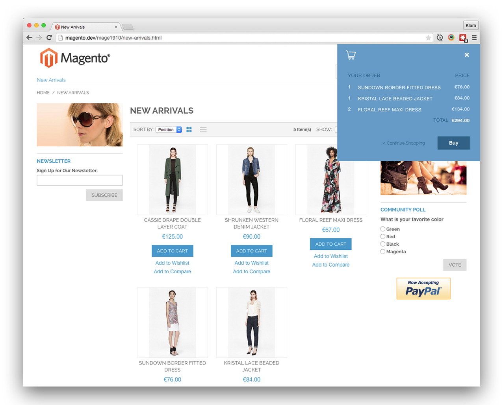

# Meanbee Corner Checkout

Checkout experiments in Magento

## Demo

Customised shopping minicar is easily accessible via icon placed in right hand corner:

Once clicked, users can preview simple list of all the items in their shopping basket including the amount of the products and total price:

or an empty shopping basket:

User then can continue shopping or checkout.

## Installation

This extension can be installed with [modman](https://github.com/colinmollenhour/modman).

Then switch to the Meanbee theme to see the changes.

Make sure to enable a theme with the right hand sidebar, e.g. 2 column-right or three columns.

Also, in System > Config > Sales > Checkout, the cart sidebar needs to be enabled.

You are more then welcome to use it on your project. Enjoy!
